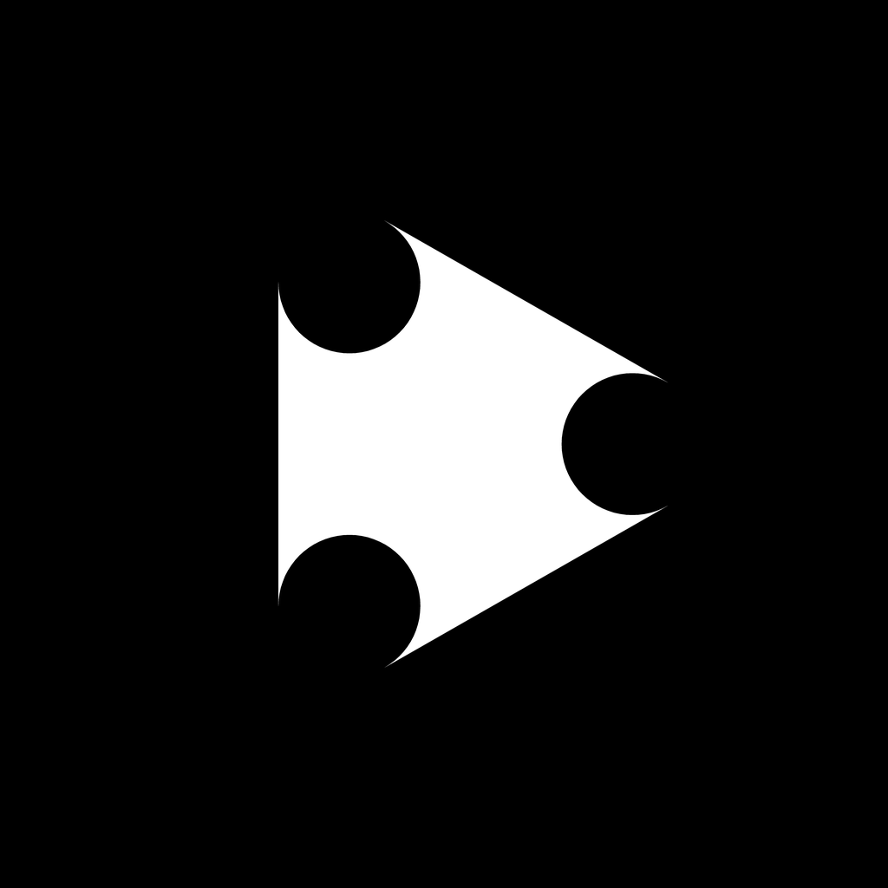

----

----

### Audio and text interleave app for:

This repository provides an implementation of a small technical assignment. For more information, check the [Terms of Reference](ToR.png)

This is the first realization of assignment. To see the second one, please check [SyncTalk-expo](https://github.com/dzch314/SyncTalk-expo).

This realization uses [@react-native-community/cli](https://github.com/react-native-community/cli) to create apps only for iOS and Android.

----
## Running the Project Locally
### Requirements

- Node.JS `v22.18.0`
- npm `v10.9.3`

Install dependencies

`npm install`

`npm run pods`

### If you want to change input files (.json and .mp3) please change them with saving their naming in [assets](/assets) folder before building the app.

Start the local development server:

`npm run start`

Build and launch the app on preferred OS:

`npm run ios`

`npm run android`

----
## Available Scripts

- `npm run android` - Build and launch the app on Android devices
- `npm run ios` - Build and launch the app on iOS devices
- `npm run start` - Start the local development server
- `npm run clean` - Reset dependencies and iOS Pods for a fresh setup
- `npm run pods`- Install iOS dependencies via CocoaPods
- `npm run prettier` - Format the codebase for consistent style

----
## Architecture
This project follows the [🍰 Feature-Sliced Design (FSD)](https://feature-sliced.design/) architecture

## Screens
- [MainScreen](/src/pages/LoginPage)

## Entities
- [MessagesList](/src/entities/MessagesList)
- [Player](/src/entities/Player)

----

## Colors

The colors for this app were chosen based on the colors from the official [Ella](https://alpha.helloella.co/) page:

